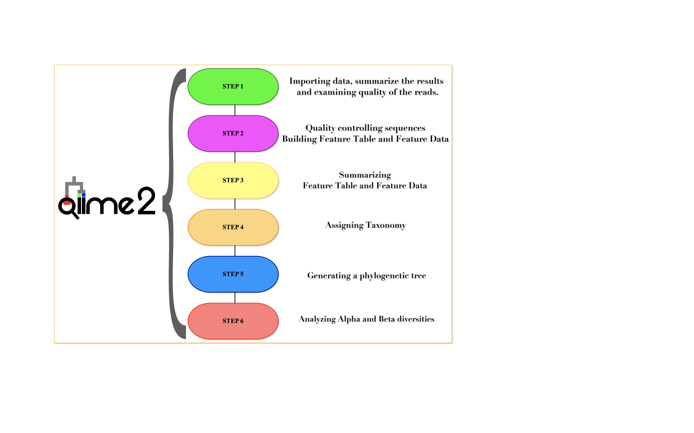

# Start the analysis
In this tutorial you’ll use QIIME2 to perform an analysis of soil samples from the Atacama Desert in northern Chile.
**You can find the starting tutorial on the official page of QIIME2** ( [link text](https://docs.qiime2.org/2020.2/tutorials/atacama-soils/))

"The Atacama Desert is one of the most arid locations on Earth, with some areas receiving less than a millimeter of rain per decade. The soil microbiomes profiled in this study follow two east-west transects, **Baquedano** and **Yungay**, across which average soil relative humidity is positively correlated with elevation (higher elevations are less arid and thus have higher average soil relative humidity). Along these transects, pits were dug at each site and soil samples were collected from three depths in each pit.""


### Experimental information
*   The v4 region of the 16S rRNA gene was amplified from all community DNA extracts using barcoded primers 515F/806R.

*   Amplicon sequencing was performed Illumina MiSeq system and MiSeq control software version 2.2.0.

You can find the paper [here](https://msystems.asm.org/content/2/3/e00195-16.abstract) or in the course Reference folder.  

## Obtain Data
Start by creating a directory to work in. We will call it **qiime2-atacama-tutorial**.  
```
mkdir qiime2-atacama-tutorial
```
```
cd qiime2-atacama-tutorial
```

### The Metadata file

Metadata play a key rule in every ecological study. For how is familiar with QIIME 1 this file correspond to "mapping file" or for R user is the env file in *vegan* package.

QIIME2 metadata is most commonly stored in a **TSV** (i.e. tab-separated values) file. These files typically have a .tsv or .txt file extension, though it doesn’t matter to QIIME2 what file extension is used.

TSV files are simple text files used to store `tabular data`, and the format is supported by many types of software, such as editing, importing, and exporting from spreadsheet programs and databases. Thus, it’s usually straightforward to manipulate QIIME 2 metadata using a software like Microsoft Excel or (better) Google Sheets to edit and export your metadata files.

You can find the [file](https://docs.google.com/spreadsheets/d/1a1NFqpBjwb8Ul0c4O68IVFb9JUn5BjLdyHr422LMfE0/edit#gid=1988763045) in the Lab folder of today or download it directly from qiime to the server by running the command:

```
wget \
  -O "sample-metadata.tsv" \
  "https://data.qiime2.org/2021.8/tutorials/atacama-soils/sample_metadata.tsv"
```

**If you would like to play around the sample-metadata.tsv file, please copy it file into another folder and have fun with it.**  
**Remember this *sample-metadata_16S.tsv* file will be used throughout the rest of the tutorial.**


Since there is no universal standard for TSV files, it is important understand how QIIME2 will interpret the file’s contents to get the most out of your (meta)data!

Sample and feature metadata files stored in Google Sheets can be validated using **Keemei**:  
 1. Select *Add-ons* 
 2. Keemei  
 3. Validate *QIIME 2 metadata file* to validate metadata stored in Google Sheets.  

QIIME 2 will also automatically validate a metadata file anytime it is used by the software.  
However, using Keemei to validate your metadata is recommended because a report of all validation errors and warnings will 
be presented each time Keemei is run.


## Start QIIME2 session

As we discussed during the introduction to UNIX-based environment, we take advantage of using *virtual environments* to avoid affecting the main OS.  
So everytime we start a new section, we need to activate the virtual environment containing our QIIME2 installation.  
```
source activate qiime2-2021.8
```

### Pipeline Overview
Here is an overview of the general steps of the QIIME2 pipeline:  



## STEP1: Importing data, summarize the results, and examining quality of the reads.
Usually, by applying a *paired ends* sequencing layout we obtain 2 *fastq* file per each processed sample.  
Technically, it means that our data are already demultiplexed. *What does it mean?*.  
It means we sequenced more samples in a single sequencing run and the machine have already seperated our data according to specific index.  

---

Take a look as the sequences are (in the most cases) generated:  


For more details have a look here:  
- [Illumina support](https://support.illumina.com/content/dam/illumina-support/documents/documentation/system_documentation/miseq/indexed-sequencing-overview-guide-15057455-04.pdf)
- [earth microbiome 16S protocols](http://www.earthmicrobiome.org/protocols-and-standards/16s/)

---

As mentioned during the previous sections, QIIME2 works with specific files called **artifacts**.  
A QIIME2 artifact contains both data and metadata.

Since QIIME2 works with artifacts instead of data files (e.g. FASTA files), you must create a QIIME2 artifact by importing your data.  
**In the coming days we will see how to import and export different objects from QIIME2 and we are going always to use artifacts.**

Artifacts enable QIIME 2 to track, in addition to the data itself, the provenance of how the data came to be.  
With an artifact’s provenance, you can trace back to all previous analyses that were run to produce the artifact, including the input data used at each step.  

So we need to import our demultiplexed raw data into a qiime artifact.  
```
qiime tools import \
    --type 'SampleData[PairedEndSequencesWithQuality]' \
    --input-path ~/Share/raw_data_tutorial \
    --input-format CasavaOneEightSingleLanePerSampleDirFmt \
    --output-path demux-paired-end.qza
```

We used the QIIME2 plugin *tools* and the function *import*, to embed our data into a ``qza`` artifact.  
To obtain an almost complete list of importable formats type the following line:  

```
qiime tools import --show-importable-formats --help
```

### Explore QIIME2 Objects

By importing the sequences you have generated your first object in QIIME2: `demux-paired-end.qza`.
Following we are interested to visualize our data and obtain some specific statistics.
```
qiime demux summarize \
  --i-data demux-paired-end.qza \
  --o-visualization demux-paired-end.qzv
```

With the command  `demux summarize` you generated a new type of objet: a file with `.qzv` extension.
*Visualizations* are another type of data generated by QIIME2.  
Visualizations contain similar types of metadata as QIIME2 artifacts, including provenance information, but they are designed to allow data showing.   

Both files (`qza` and `qzv`) can be **extracted** with a Compression/Decompression software (ex. gzip or unzip).

Let's look  together,  download on your PC and unzip it. **What's inside?**

There are also different ways to [export QIIME2 objects](https://docs.qiime2.org/2021.8/tutorials/exporting/).
But remember that all existing provenance will be lost after exporting the files.

--- 

***In some cases you can have to manage multiplexed data...How to import the files? [We will discuss it in the next days](../DataImport_and_Tax_management/readme.md)***

---

### Visualize with QIIME2 viewer

You can use [https://view.qiime2.org](https://view.qiime2.org) to easily view QIIME2 artifacts and visualizations files (generally .qza and .qzv files (see later)) without requiring a QIIME installation.

Open it and drag and drop your qza or qzv file.   
*You need to download the `demux-paired-end.qzv` file on your computer and then upload it on the viewer.*  

Automatically, the **Overview** tab is opened and some basic statistics about our data are available.  
In the **Interactive quality plot** tab we can access to the quality distributions of our data. The plot on the left represents the quality scores for the **forward** reads and the plot on the right presents the quality scores for the **reverse** reads.  
In this example we have **150-base forward and reverse reads**.  

We’ll use these plots to determine what trimming parameters we want to use for data denoising with DADA2 by using the **dada2 denoise-paired** plugin.

  
# Step2: Quality controlling sequences and building Feature Table and Feature Data
[**Key concept: OTU or ASV**](https://docs.google.com/presentation/d/1Rxof51tbTxi45_dMlqtbFkQjpWRLTc76uoI6VH8b3hA/edit?usp=sharing)  
After importing the reads, we have inspected the sequence quality based on randomly selected samples.  
What we now need is to remove the noise introduced during amplification and sequencing.

## Quality filter of 16S
Since we need the reads to be long enough to overlap when joining paired ends, the first thirteen bases of the forward and reverse reads are being trimmed, but no trimming is being applied to the ends of the sequences to avoid reducing the read length by too much.

In this example, the same values are being provided for `--p-trim-left-f` and `--p-trim-left-r` and for `--p-trunc-len-f` and `--p-trunc-len-r`, but that is not a requirement.  
We're also using a multi-threading command to split the processing across multiple CPUs, which will be very useful when performing your own analysis with larger datasets.

```
qiime dada2 denoise-paired \
  --i-demultiplexed-seqs demux-paired-end.qza \
  --p-trim-left-f 13 \
  --p-trim-left-r 13 \
  --p-trunc-len-f 150 \
  --p-trunc-len-r 150 \
  --p-n-threads 2 \
  --o-table table_16S.qza \
  --o-representative-sequences rep-seqs_16S.qza \
  --o-denoising-stats denoising-stats_16S.qza
```

Following we need to generate a qzv file containing the a table summarizing the denoising process, so we can discuss the effect it had on the data.
```
qiime metadata tabulate \
  --m-input-file denoising-stats_16S.qza \
  --o-visualization denoising-stats_16S.qzv
```

---
#### 454 and Ion Torrent data
To whom it may be interested at this [**link**](https://benjjneb.github.io/dada2/faq.html#can-i-use-dada2-with-my-454-or-ion-torrent-data) you may find some suggestion to apply **DADA2** on 454 and Ion Torrent data.

---

# Step 3: Summarizing Feature Table and Feature Data

## Summaraize 16S data
You  now will have artifacts containing the feature table and corresponding feature sequences.  
You can generate summaries of those as follows.

```
qiime feature-table summarize \
  --i-table table_16S.qza \
  --o-visualization table_16S.qzv \
  --m-sample-metadata-file sample-metadata.tsv
```

```
qiime feature-table tabulate-seqs \
  --i-data rep-seqs_16S.qza \
  --o-visualization rep-seqs.qzv
```


# Step 4 Taxonomy assignment 
<details>
  <summary markdown="span">Please remember to access the qiime2-atacama-tutorial folder and activate QIIME2</summary>

    cd ~/qiime2-atacama-tutorial  

    source activate qiime2-2021.8
</details>


## 16S taxonomy assignment 
The QIIME 2 plugin [feature-classifier](https://docs.qiime2.org/2021.8/plugins/available/feature-classifier/) supports taxonomic classification of features using a variety of methods, including:  
 1. **Naive Bayes**;  
 2. **vsearch**; 
 3. **BLAST+**.  

The `q2-feature-classifier` contains three different classification methods. **classify-consensus-blast** and **classify-consensus-vsearch** are both *alignment-based methods*, that find a consensus assignment across N top hits. These methods take reference database `FeatureData[Taxonomy]` and `FeatureData[Sequence]` files directly, and do not need to be pre-trained.
We’ll do that using a pre-trained ***Naive Bayes classifier*** and the **q2-feature-classifier plugin**.  
This classifier was trained on the *SILVA 138 NR99 collection*, where the sequences have been trimmed to only include 250 bases from the region of the 16S that was sequenced in this analysis (the V4 region, bound by the 515F/806R primer pair).  
We’ll apply this classifier to our sequences, and we can generate a visualization of the resulting mapping from sequence to taxonomy.

Initially, we need to download the pre-computed classifier:
```
wget \
  -O "silva-138-99-515-806-nb-classifier.qza" \
  "https://data.qiime2.org/2021.8/common/silva-138-99-515-806-nb-classifier.qza"
```

The first step in this process is to assign taxonomy to the sequences in our `FeatureData[Sequence]` QIIME 2 artifact. 

```
qiime feature-classifier classify-sklearn \
  --i-classifier silva-138-99-515-806-nb-classifier.qza \
  --i-reads rep-seqs_16S.qza \
  --o-classification taxonomy_16S_SKLEARN.qza 
```

<details>
  <summary markdown="span">If you were not able to complete the taxonomic classification just copy/paste the pre-computed one.</summary> 
    
    cp ~/Share/taxonomy_16S.qza .
</details>

Once the classification is done we can generate the barplot for data visualization:  
```
qiime metadata tabulate \
  --m-input-file taxonomy_16S_SKLEARN.qza \
  --o-visualization taxonomy_16S_SKLEARN.qzv
```

```
qiime metadata tabulate \
  --m-input-file taxonomy_16S_SKLEARN.qza  \
  --m-input-file rep-seqs_16S.qza  \
  --o-visualization annotated_rep-set_16S.qzv
```

```
qiime taxa barplot \
  --i-table table_16S.qza \
  --i-taxonomy taxonomy_16S.qza \
  --m-metadata-file sample-metadata.tsv \
  --o-visualization taxa-bar-plots_16S_SKLEARN.qzv
```

# Step 5: Generating a phylogenetic tree
We have to generate phylogenetic tree because QIIME2 support different phylogenetic diversity metrics, including Faith’s Phylogenetic Diversity and weighted and unweighted UniFrac. 

In addition to counts of features per sample (i.e., the data in the `FeatureTable[Frequency]` QIIME 2 artifact), these metrics require a rooted phylogenetic tree relating the features to one another. This information will be stored in a `Phylogeny[Rooted]` QIIME 2 artifact. To generate a phylogenetic tree we will use **align-to-tree-mafft-fasttree** pipeline from the q2-phylogeny plugin`.

* First, the pipeline uses the **mafft** program to perform a multiple sequence alignment of the sequences in our `FeatureData[Sequence]` to create a `FeatureData[AlignedSequence]` QIIME 2 artifact. 

* Next, the pipeline **masks** (or filters) the alignment to remove positions that are highly variable. These positions are generally considered to add noise to a resulting phylogenetic tree. 

* Following that, the pipeline applies **FastTree** to generate a phylogenetic tree from the masked alignment. The FastTree program creates an unrooted tree

* The final step in this section midpoint **rooting** is applied to place the root of the tree at the midpoint of the longest tip-to-tip distance in the unrooted tree.


```
qiime phylogeny align-to-tree-mafft-fasttree \
  --i-sequences rep-seqs_16S.qza \
  --o-alignment aligned-rep-seqs.qza \
  --o-masked-alignment masked-aligned-rep-seq.qza \
  --o-tree unrooted-tree_16S.qza \
  --o-rooted-tree rooted-tree_16S.qza
```

# Step 6: Analyzing Alpha and Beta diversities

First, lets look at alpha diversity as a function of sequencing depth, as a test of our sequencing run.  

```
qiime diversity alpha-rarefaction \
  --i-table table_16S.qza \
  --i-phylogeny rooted-tree_16S.qza \
  --p-max-depth 8000 \
  --m-metadata-file sample-metadata.tsv \
  --o-visualization alpha-rarefaction.qzv
```

QIIME 2’s diversity analyses are available through the [`q2-diversity plugin`](https://docs.qiime2.org/2020.2/plugins/available/diversity/), which supports computing alpha and beta diversity metrics, applying related statistical tests, and generating interactive visualizations. We’ll first apply the core-metrics-phylogenetic method, which rarefies a `FeatureTable[Frequency]` to a user-specified depth, computes several alpha and beta diversity metrics, and generates **Principle Coordinates Analysis (PCoA)** plots using Emperor for each of the beta diversity metrics. The metrics computed by default are:

**Alpha diversity**
* Shannon’s diversity index (a quantitative measure of community richness)
* Observed OTUs (a qualitative measure of community richness)
* Faith’s Phylogenetic Diversity (a qualitative measure of community richness that incorporates phylogenetic relationships between the features)
* Evenness (or Pielou’s Evenness; a measure of community evenness)

**Beta diversity**
* Jaccard distance (a qualitative measure of community dissimilarity)
* Bray-Curtis distance (a quantitative measure of community dissimilarity)
* unweighted UniFrac distance (a qualitative measure of community dissimilarity that incorporates phylogenetic relationships between the features)
* weighted UniFrac distance (a quantitative measure of community dissimilarity that incorporates phylogenetic relationships between the features)

An important parameter that needs to be provided to this script is **--p-sampling-depth**, which is the even sampling (i.e. rarefaction) depth.

```
qiime diversity core-metrics-phylogenetic \
  --i-phylogeny rooted-tree_16S.qza \
  --i-table table_16S.qza \
  --p-sampling-depth 1000 \
  --m-metadata-file sample-metadata.tsv \
  --output-dir core-metrics-results_16S
````
From these outputs, a range of datasets and visualisations are generated that can be tested in the next steps, or explored visually. Let's look at the 'emperor' PCoA results.

## Time to test

We’ll first test for associations between **categorical** metadata columns and alpha diversity data. We’ll do that here for the Faith Phylogenetic Diversity (a measure of community richness) and evenness metrics.

```
qiime diversity alpha-group-significance \
  --i-alpha-diversity core-metrics-results_16S/faith_pd_vector.qza \
  --m-metadata-file sample-metadata.tsv \
  --o-visualization core-metrics-results_16S/faith-pd-group-significance_16S.qzv
```

```
qiime diversity alpha-group-significance \
  --i-alpha-diversity core-metrics-results_16S/evenness_vector.qza \
  --m-metadata-file sample-metadata.tsv \
  --o-visualization core-metrics-results_16S/evenness-group-significance.qzv
```

```
qiime diversity alpha-group-significance \
  --i-alpha-diversity core-metrics-results_16S/shannon_vector.qza \
  --m-metadata-file sample-metadata.tsv \
  --o-visualization core-metrics-results_16S/shannon-group-significance.qzv
```

Using **Pearson** and **Spearman** correlation it is possible to determine whether numeric sample metadata columns are correlated with
alpha diversity.

```
qiime diversity alpha-correlation \
  --i-alpha-diversity core-metrics-results_16S/shannon_vector.qza \
  --m-metadata-file sample-metadata.tsv \
  --p-method spearman \
  --o-visualization core-metrics-results_16S/shannon_correlation.qzv
```

```
qiime diversity alpha-correlation \
  --i-alpha-diversity core-metrics-results_16S/faith_pd_vector.qza \
  --m-metadata-file sample-metadata.tsv \
  --p-method spearman \
  --o-visualization core-metrics-results_16S/faith_pd_correlation.qzv
````


Next we’ll analyze sample composition in the context of categorical metadata using **PERMANOVA** (first described in [Anderson (2001)](https://onlinelibrary.wiley.com/doi/full/10.1111/j.1442-9993.2001.01070.pp.x)) using the beta-group-significance command. The following commands will test whether distances between samples within a group, are more similar to each other then they are to samples from the other groups. In this case we test only for the Transect_name and for the vegetation

```
qiime diversity beta-group-significance \
  --i-distance-matrix core-metrics-results_16S/unweighted_unifrac_distance_matrix.qza \
  --m-metadata-file sample-metadata.tsv \
  --m-metadata-column transect-name \
  --o-visualization core-metrics-results_16S/unweighted-unifrac-tran-name-significance.qzv \
  --p-pairwise
```

```
qiime diversity beta-group-significance \
  --i-distance-matrix core-metrics-results_16S/unweighted_unifrac_distance_matrix.qza \
  --m-metadata-file sample-metadata.tsv \
  --m-metadata-column vegetation \
  --o-visualization core-metrics-results_16S/unweighted-unifrac-subject-group-significance.qzv \
  --p-pairwise
 ```

[**Back to the program**](../README.md)  
