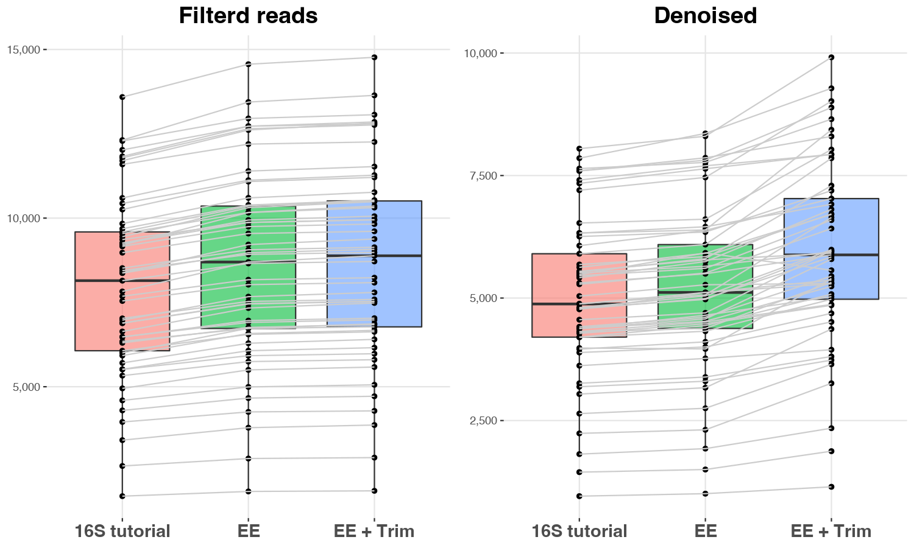

Some additional Tips
====

1. [Some example of data import](#some-example-of-data-import)
   1. [Importing not demultiplexed data](#importing-not-demultiplexed-data)
   2. [Importing demultiplexed by using the manifest file](#importing-demultiplexed-by-using-the-manifest-file)
2. [Evaluating data quality](#evaluating-data-quality)
3. [Improving the Denoising step](#improving-the-denoising-step)
4. [Collections for taxonomic classification](#collections-for-taxonomic-classification)
   1. [Train a classifier for a specific 16S region](#train-a-classifier-for-a-specific-16s-region)
   2. [Importing a reference collection in QIIME2 and train the classifier](#importing-a-reference-collection-in-qiime2-and-train-the-classifier)
5. [Export ASV table to tsv](#export-asv-table-to-tsv)
6. [Filter table to only have those samples in the metadata file](#filter-table-to-only-have-those-samples-in-the-metadata-file)
   1. [Filter the table according to a specific samples subset](#filter-the-table-according-to-a-specific-samples-subset)
   2. [Filter the table according to a specific feature]()
7. [Import ASV table obtaiend outside QIIME2 into it](#import-asv-table-obtaiend-outside-qiime2-into-it)  

---
***Always remember to active QIIME2 environment!!!***  
:walking:  
```
conda activate qiime2-2022.2
```
---

In order to avoid to make confusion about different stuffs, we are going to generate new folders.  
First just get back in your `home` folder:  
:walking:  
```
cd
```

# Some example of data import
## Importing not demultiplexed data
During our tutorial we've faced with already demuliplexed data.  
Sometimes you need to perform the data demultiplexing, so let's demultiplex them!!!    
*** Check you are in your home folder***  
Let's create a folder for multiplexed data  in your **home folder**:  
:walking:  
```
mkdir multiplexed_data && cd multiplexed_data
```  
Now we need to make a folder that will contain all our data:  
:walking:  
```
mkdir emp-paired-end-sequences
```  
Let's download the required files:  
:walking:  
```
wget -O "emp-paired-end-sequences/forward.fastq.gz" \
  "https://data.qiime2.org/2022.2/tutorials/atacama-soils/10p/forward.fastq.gz"

wget -O "emp-paired-end-sequences/reverse.fastq.gz" \
  "https://data.qiime2.org/2022.2/tutorials/atacama-soils/10p/reverse.fastq.gz"

wget -O "emp-paired-end-sequences/barcodes.fastq.gz" \
  "https://data.qiime2.org/2022.2/tutorials/atacama-soils/10p/barcodes.fastq.gz"
```  
We are also going to reuse the ``sample-metadata.tsv`` file used during the QIIME2 tutorial:  
:walking:  
```
cp ~/qiime2-atacama-tutorial/sample-metadata.tsv .
```
Now let's import everything as a QIIME2 artifact:  
:walking:  
```
qiime tools import \
   --type EMPPairedEndSequences \
   --input-path emp-paired-end-sequences \
   --output-path emp-paired-end-sequences.qza
```
So we can perform the demultiplexing step:  
:walking:  
```
qiime demux emp-paired \
  --m-barcodes-file sample-metadata.tsv \
  --m-barcodes-column barcode-sequence \
  --p-rev-comp-mapping-barcodes \
  --i-seqs emp-paired-end-sequences.qza \
  --o-per-sample-sequences demux-full.qza \
  --o-error-correction-details demux-details.qza
```

Let's visualize our data!!!  
:walking:  
```
qiime demux summarize \
  --i-data demux-full.qza \
  --o-visualization demux-full.qzv
```

## Importing demultiplexed by using the manifest file
During the main tutorial we imported the PE fastq files by using:  
 - **type** `SampleData[PairedEndSequencesWithQuality]`: which means we are using PE fastq files;
 - **input-format** `CasavaOneEightSingleLanePerSampleDirFmt`: which means the file name are formatted by using the **CASAVA** file format.  

Sometimes our data are not formatted according to **CASAVA** format, so we need to use an alternative way to import the data.  
To import the data we need to generate a **manifest file**.  

Initially we need to create a new folder in our home just because we could re-use this data for other stuff.  
:walking:  
```
cd

mkdir IJMS_training_test && cd IJMS_training_test
```    
Let's have a look to our data:
:walking:  
```
ls /home/Share/IJMS_data/IJMS_input_data
```

Now we can create our file named `manifest_file.tsv`:  
:walking:  
```
echo sample-id,forward-absolute-filepath,reverse-absolute-filepath > manifest_file.tsv
echo 211446F203610,/home/Share/IJMS_data/IJMS_input_data/211446F203610_S155_L001_R1_001.fastq.gz,/home/Share/IJMS_data/IJMS_input_data/211446F203610_S155_L001_R2_001.fastq.gz >> manifest_file.tsv
echo 211454F203618,/home/Share/IJMS_data/IJMS_input_data/211454F203618_S163_L001_R1_001.fastq.gz,/home/Share/IJMS_data/IJMS_input_data/211454F203618_S163_L001_R2_001.fastq.gz >> manifest_file.tsv
echo 211456F203620,/home/Share/IJMS_data/IJMS_input_data/211456F203620_S165_L001_R1_001.fastq.gz,/home/Share/IJMS_data/IJMS_input_data/211456F203620_S165_L001_R2_001.fastq.gz >> manifest_file.tsv
echo 211460F203624,/home/Share/IJMS_data/IJMS_input_data/211460F203624_S169_L001_R1_001.fastq.gz,/home/Share/IJMS_data/IJMS_input_data/211460F203624_S169_L001_R2_001.fastq.gz >> manifest_file.tsv
echo 214981F203626,/home/Share/IJMS_data/IJMS_input_data/214981F203626_S2_L001_R1_001.fastq.gz,/home/Share/IJMS_data/IJMS_input_data/214981F203626_S2_L001_R2_001.fastq.gz >> manifest_file.tsv
echo 214991F203636,/home/Share/IJMS_data/IJMS_input_data/214991F203636_S12_L001_R1_001.fastq.gz,/home/Share/IJMS_data/IJMS_input_data/214991F203636_S12_L001_R2_001.fastq.gz >> manifest_file.tsv
echo 214993F203638,/home/Share/IJMS_data/IJMS_input_data/214993F203638_S14_L001_R1_001.fastq.gz,/home/Share/IJMS_data/IJMS_input_data/214993F203638_S14_L001_R2_001.fastq.gz >> manifest_file.tsv
echo 214997F203642,/home/Share/IJMS_data/IJMS_input_data/214997F203642_S18_L001_R1_001.fastq.gz,/home/Share/IJMS_data/IJMS_input_data/214997F203642_S18_L001_R2_001.fastq.gz >> manifest_file.tsv
echo 215001F203646,/home/Share/IJMS_data/IJMS_input_data/215001F203646_S22_L001_R1_001.fastq.gz,/home/Share/IJMS_data/IJMS_input_data/215001F203646_S22_L001_R2_001.fastq.gz >> manifest_file.tsv
echo 215003F203648,/home/Share/IJMS_data/IJMS_input_data/215003F203648_S24_L001_R1_001.fastq.gz,/home/Share/IJMS_data/IJMS_input_data/215003F203648_S24_L001_R2_001.fastq.gz >> manifest_file.tsv
```
A little trick for our manifest file.  
```
sed -i -e 's/,/\t/g' manifest_file.tsv 
```

Obviously you can also use **Excel** or **Google Sheet** to generate the tabular file. You just need to export the file as a _tabular text file_.

Now we're ready to import our data and generate a visualization file:  
:walking:  
```
qiime tools import \
  --type 'SampleData[PairedEndSequencesWithQuality]' \
  --input-path manifest_file.tsv \
  --output-path pe-demux.qza \
  --input-format PairedEndFastqManifestPhred33V2
  
qiime demux summarize \
    --i-data  pe-demux.qza \
    --o-visualization pe-demux.qzv
```

# Evaluating data quality
We have already discussed **FastQC**. It is a really useful tool but the main drawback is it generates a report for file for each analysed fastq file.  
So it is not so simple to figure out what is overall the quality of our raw data.  
A solution is to apply [**MultiQC**](https://multiqc.info/) a tool allowing to *aggregate results from bioinformatics analyses across many samples into a single report*.  

Create a folder that will contain all the FastQC reports:  
:walking:  
```
cd

mkdir fastqc_reports 
```
Execute FastQC on our raw data. In order to save time we're going to evaluate only `Baquedano`. In our test case, it is simple cause those file names start with `BAQ`.  
:walking:     
```
fastqc  /home/Share/raw_data_tutorial/BAQ2420* -O fastqc_reports
```
:walking:      
```
multiqc -n sequencing_data_report fastqc_reports/
```

Now by using *FileZilla* download on your computers these items:  
* `sequencing_data_report.html`  
* `sequencing_data_report_data`  

## Improving the Denoising step
Now let's try to improve our denoising step by modifying **DADA2** import parameters:  
:walking:  
```
cd ~/qiime2-atacama-tutorial
mkdir denoising_alt && cd denoising_alt
```

Now we re-perform the denoising step by modifying the **Expected Error (ee)** threshold.  
Just remember **ee** is a way to measure the number of nucleotides that are probably wrong in our sequences:  
  
:stop_sign:  
The option we introduce are `--p-max-ee-f` and `--p-max-ee-f`.
```
qiime dada2 denoise-paired \
  --i-demultiplexed-seqs ../demux-paired-end.qza \
  --p-trim-left-f 13 \
  --p-trim-left-r 13 \
  --p-trunc-len-f 150 \
  --p-trunc-len-r 150 \
  --o-table table_ee.qza \
  --p-max-ee-f 3 \
  --p-max-ee-r 3 \
  --o-representative-sequences rep-seqs_ee.qza \
  --o-denoising-stats denoising-stats_ee.qza

qiime metadata tabulate \
   --m-input-file denoising-stats_ee.qza \
   --o-visualization denoising-stats_ee.qzv

qiime feature-table summarize \
  --i-table table_ee.qza \
  --o-visualization table_ee.qzv \
  --m-sample-metadata-file ../sample-metadata.tsv
  
qiime feature-table tabulate-seqs \
  --i-data rep-seqs_ee.qza \
  --o-visualization rep-seqs_ee.qzv
```

Now copy the obtained results and try to compare them by using [QIIME2 view](https://view.qiime2.org/).    
```
cp /home/Share/qiime2-atacama-tutorial/denoising_alt/{denoising-stats_ee.qzv,table_ee.qzv,rep-seqs_ee.qzv} .
```  

Now considering the length of the ASVs we've obtained yesterday, probably we should trim our raw reads:  
:stop_sign:  
The option we are going to modify are  introduce are `--p-trunc-len-f` and `--p-trunc-len-r`.
```
qiime dada2 denoise-paired \
  --i-demultiplexed-seqs ../demux-paired-end.qza \
  --p-trim-left-f 13 \
  --p-trim-left-r 13 \
  --p-trunc-len-f 145 \
  --p-trunc-len-r 130 \
  --o-table table_ee_tt.qza \
  --p-max-ee-f 3 \
  --p-max-ee-r 3 \
  --o-representative-sequences rep-seqs_ee_tt.qza \
  --o-denoising-stats denoising-stats_ee_tt.qza

qiime metadata tabulate \
   --m-input-file denoising-stats_ee_tt.qza \
   --o-visualization denoising-stats_ee_tt.qzv

qiime feature-table summarize \
  --i-table table_ee_tt.qza \
  --o-visualization table_ee_tt.qzv \
  --m-sample-metadata-file ../sample-metadata.tsv
  
qiime feature-table tabulate-seqs \
  --i-data rep-seqs_ee_tt.qza \
  --o-visualization rep-seqs_ee_tt.qzv
```
Now copy the obtained results and try to compare them by using [QIIME2 view](https://view.qiime2.org/).    
```
cp /home/Share/qiime2-atacama-tutorial/denoising_alt/{denoising-stats_ee_tt.qzv,table_ee_tt.qzv,rep-seqs_ee_tt.qzv} .
```  

Just to resume the results:  

|    | 16S Tutorial | EE | EE + Trim |
|----|:---------:|:--------:|:-----:|
|ASVs| 2,934 | 2,947 | 4,189|
|% filtered | 89.6 |	96.6 |	97.7 |
|% denoised| 57.1 | 59.4 | 67.7 |




## Collections for taxonomic classification
In order to perform taxonomic classification in QIIME2 we need to properly import and, eventually, train reference collections:
The available in databases [**QIIME2 Data resoruces**](https://docs.qiime2.org/2020.8/data-resources/) are:  
* [SILVA](https://www.arb-silva.de/)
* [GreenGenes](https://www.nature.com/articles/ismej2011139)  
* [UNITE](https://unite.ut.ee/)  

### Train a classifier for a specific 16S region
If your are interested in metabarcoding analysis based on the **COX1** barcode, you may consider [**MIDORI**](http://www.reference-midori.info/).  
 
The easiest case is *SILVA*. QIIME Developers have already created an appropriate version so you can just dowload it:
:stop_sign:  
```
cd
mkdir tax_import && cd tax_import
```
So let's start with `qza` data download:  
:stop_sign:  
```
wget --no-check-certificate https://data.qiime2.org/2022.2/common/silva-138-99-seqs.qza
wget --no-check-certificate https://data.qiime2.org/2022.2/common/silva-138-99-tax.qza
```
If you plan to use alignment based approaches for taxonomic assigment (i.e. BLAST or VSEARCH), that's enough. You may proceed with ASV classification.  
Otherwise, if you would like to use the **sklearn** approach you need to train the classifier.  
For 16S data, it is recommended to firstly extract the region you're interested in by using your primer sequences:  
In the **EXAMPLE** below we are extracting the V3-V4 hyper-variable regions from SILVA 16S full-lenght sequences by using Illumina V3V4 primers.   

Both the following two steps are quite time-consuming so, we are just going to discuss how to do that.  
Initially, we extract from our reference collection, only the regions in which we are interested:  
:stop_sign:  
```
qiime feature-classifier extract-reads \
  --i-sequences silva-138-99-seqs.qza \
  --p-f-primer CCTACGGGNGGCWGCAG \
  --p-r-primer GGACTACNVGGGTWTCTAAT \
  --p-n-jobs 20 \
  --o-reads v3v4.ref-seqs.qza
```

There are some additional options you could consider:
 * `--p-min-length`: min amplicon length  
 * `--p-max-length`: max amplicon length  

Finally, we are ready to train a classifier specifically designed for the V3V4 region:  
:stop_sign:  
```
qiime feature-classifier fit-classifier-naive-bayes  \
    --i-reference-reads v3v4.ref-seqs.qza \
    --i-reference-taxonomy silva-138-99-tax.qza \
    --o-classifier v3v4.SILVA_138_NR_99_classifier.qza
```

### Importing a reference collection in QIIME2 and train the classifier
In some cases, you also need to import reference sequences and taxonomy in QIIME2.
Let's try to import MIDORI data in QIIME2:  
:walking:  
```
cd

mkdir MIDORI_ref && cd MIDORI_ref 
```
Download MIDORI data. It has been already properly formatted for QIIME2 import:  
:walking:  
```
wget --no-check-certificate http://www.reference-midori.info/download/Databases/GenBank249/QIIME/uniq/MIDORI_UNIQ_NUC_GB249_CO1_QIIME.fasta.gz
wget --no-check-certificate http://www.reference-midori.info/download/Databases/GenBank249/QIIME/uniq/MIDORI_UNIQ_NUC_GB249_CO1_QIIME.taxon.gz
```
Then we need un unpack the downloaded data.  
:walking:  
```
gzip -d MIDORI_UNIQ_NUC_GB249_CO1_QIIME.fasta.gz 
gzip -d MIDORI_UNIQ_NUC_GB249_CO1_QIIME.taxon.gz
```

Now we are ready to import the reference collection data. We begin by importing the fasta file:  
:walking:  
```
qiime tools import \
  --input-path MIDORI_UNIQ_NUC_GB249_CO1_QIIME.fasta \
  --output-path MIDORI_UNIQ_NUC_GB249_CO1_QIIME.qza \
  --type 'FeatureData[Sequence]'
```

Finally, we import also the taxonomic annotation of the reference sequences:  
:walking:  
```
qiime tools import \
 --type FeatureData[Taxonomy] \
 --input-path MIDORI_UNIQ_NUC_GB249_CO1_QIIME.taxon \
 --input-format HeaderlessTSVTaxonomyFormat \
 --output-path MIDORI_UNIQ_NUC_GB249_CO1_QIIME.taxon.qza
```

The final step is to train use these data for alignement based approaches for the taxonomic classification.  

## Export ASV table to tsv
Sometimes you need to export you ASV table to TSV:  
:walking:  
```
cd ~/qiime2-atacama-tutorial

qiime tools export --input-path table_16S.qza --output-path ASV_table_exports/
```
We obtain the ASV table in [BIOM](http://biom-format.org) format. Let's convert it in tsv.  
:walking:  
```
biom convert -i ASV_table_exports/feature-table.biom -o ASV_table_exports/feature-table.txt --to-tsv
```
Note that this table doesn't currently contain taxonomy information. To merge the tables you can use the ```qiime taxa collapse``` command below at ASV level, or the function in the taxonomy barcharts visualisation.

## Filter table to only have those samples in the metadata file
Filtering only certain samples or features. Useful to remove anomalies, negative/positive controls or failed samples, or subset data for specific analysis  
:walking:  
```
cd ~/qiime2-atacama-tutorial

mkdir data_filtering && cd data_filtering 
```
### Filter the table according to a specific samples subset
Let's create ad small metadata file containing only 10 samples.  
:walking:  
```
head -n 11 ../sample-metadata.tsv > my_metadata.csv
```
:walking:  
```
qiime feature-table filter-samples \
  --i-table ../table_16S.qza \
  --m-metadata-file my_metadata.csv \
  --o-filtered-table my_table.qza
```
### Filter the table according to a specific feature
Filter table by a specific metadata column value:  
:walking:  
```
qiime feature-table filter-samples \
  --i-table ../table_16S.qza \
  --m-metadata-file ../sample-metadata.tsv \
  --p-where "[transect-name]='Baquedano'" \
  --o-filtered-table Baquedano.qza
```

Remove features with less than 100 reads in at least 4 samples  
:walking:  
```
qiime feature-table filter-features \
  --i-table ../table_16S.qza \
  --p-min-frequency 100 \
  --p-min-samples 4 \
  --o-filtered-table table-selected.qza
```

Collapse the whole table to a specific taxonomy level (i.e. family) and include taxonomy description:  
:walking:  
```
qiime taxa collapse \
  --i-table ../table_16S.qza \
  --i-taxonomy ../taxonomy_16S_SKLEARN.qza \
  --p-level 5 \
  --o-collapsed-table table-l5.qza
```

## Import ASV table obtained outside QIIME2 into it
Sometimes it is useful to apply DADA2 outside QIIME2. Nonetheless, it is always possibile to import DADA2 ASVs table in QIIME2.  
:walking:  
```
cd

mkdir dada2_data_import && cd dada2_data_import

cp /home/Share/seqtab-nochim.txt .
```
Let's inspect how `seqtab-nochim.txt` is made:  
:walking:  
```
less seqtab-nochim.txt
```
Actually the problem is we have features sequence instead of md5 name in the ASV column. We may convert it by using **Python**.  
Enter the Python Shell:  
:walking:  
```
ipython
```
First, we import the needed functions:  
```
import hashlib
import sys
import pandas as pd
```
Then we generate the file for ASV table and representative sequences and convert our table:
```
df = pd.read_csv("seqtab-nochim.txt", sep = "\t", index_col = 0, header = 0)
with open("rep-seqs_HEX.fna", "w") as tmp:
    new_asv = []
    for i in df.index:
      m = hashlib.md5()
      m.update(i.encode('utf-8'))
      tmp.write(">{}\n{}\n".format(m.hexdigest(), i))
      new_asv.append(m.hexdigest())
    df.index = new_asv
df.to_csv("seqtab-nochim_hash.txt", sep="\t",quoting=False)
```

Finally, close Python;  
:walking:  
```
quit()
```
Now we're ready to import data in QIIME2!!!
First convert the textual table into a biom table:  
:walking:  
```
biom convert -i seqtab-nochim_hash.txt -o seqtab-nochim.biom --table-type="OTU table" --to-hdf5
```
Now we cam import the BIOM table into a `qza` artifact.  
:walking:  
```
qiime tools import \
--input-path seqtab-nochim.biom \
--type 'FeatureTable[Frequency]' \
--input-format BIOMV210Format \
--output-path feature-table.qza
```
Then import your ASVs sequences:  
:walking:  
```
qiime tools import \
--input-path rep-seqs_HEX.fna \
--type 'FeatureData[Sequence]' \
--output-path rep-seqs.qza
```
Finally, we may inspect our feature table:  
:walking:  
```
qiime feature-table summarize \
   --i-table feature-table.qza \
   --o-visualization feature-table.qzv 
```

[**Back to the program**](../README.md)