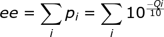

# Some additional Tips
[Importing not demultiplexed data](#importing-not-demultiplexed-data)  
[Evaluating data quality](#evaluating-data-quality)  
[Improving the Denoising step](#improving-the-denoising-step)  
[Collections for taxonomic classification](#collections-for-taxonomic-classification)  
[Export ASV table to tsv](#export-asv-table-to-tsv)  
[Import ASV table processed with DADA2 outside QIIME2](#import-asv-table-processed-with-dada2-outside-qiime)  
[Filter table to only have those samples in the metadata file](#filter-table-to-only-have-those-samples-in-the-metadata-file)  

Always remember to active QIIME2 environment!!!  
```
source activate qiime2-2021.8
```

## Importing not demultiplexed data
Let's start with multiplexed sequence reads case.  
*** Check you are in your home folder***  
Let's create a folder for multiplexed data  in your **home folder**:
```
mkdir multiplexed_data && cd multiplexed_data
```  
Now we need to make a folder that will contain all our data:
```
mkdir emp-paired-end-sequences
```  
Let's download the required files:
```
wget \
  -O "emp-paired-end-sequences/forward.fastq.gz" \
  "https://data.qiime2.org/2020.2/tutorials/atacama-soils/10p/forward.fastq.gz"

wget \
  -O "emp-paired-end-sequences/reverse.fastq.gz" \
  "https://data.qiime2.org/2020.2/tutorials/atacama-soils/10p/reverse.fastq.gz"

wget \
  -O "emp-paired-end-sequences/barcodes.fastq.gz" \
  "https://data.qiime2.org/2020.2/tutorials/atacama-soils/10p/barcodes.fastq.gz"
```  
We are also going to reuse the ``sample-metadata.tsv`` file used during the QIIME2 tutorial:  
```
cp ~/qiime2-atacama-tutorial/sample-metadata.tsv .
```
Now let's import everything as a QIIME2 artifact:  
```
qiime tools import \
   --type EMPPairedEndSequences \
   --input-path emp-paired-end-sequences \
   --output-path emp-paired-end-sequences.qza
```
So we can perform the demultiplexing step:  
```
qiime demux emp-paired \
  --m-barcodes-file sample-metadata.tsv \
  --m-barcodes-column barcode-sequence \
  --p-rev-comp-mapping-barcodes \
  --i-seqs emp-paired-end-sequences.qza \
  --o-per-sample-sequences demux.qza \
  --o-error-correction-details demux-details.qza
```

Let's visualize our data!!!  
```
qiime demux summarize \
  --i-data demux.qza \
  --o-visualization demux.qzv
```

We may compare the obtained `demux.qzv` with the `demux-paired-end.qzv` generated during our tutorial.

## Evaluating data quality
We are going to evaluate the quality of our sequencing data by using **FastQC**.  
Create a folder that will contain all the FastQC reports:  
```
mkdir fastqc_reports
```
Execute FastQC on our raw data. In order to save time we're going to evaluate only `Baquedano`. In our test case, it is simple cause those file names start with `BAQ`.  
   
```
fastqc -t 2 ~/Share/raw_data_tutorial/BAQ* -O fastqc_reports
```
FastQC creates a report for each analysed file and it is not so simple to figure out what is overally the quality of our sequencing data.  
A solution is to apply [**MultiQC**](https://multiqc.info/) a tool allowing to *aggregate results from bioinformatics analyses across many samples into a single report*.    
```
multiqc -n sequencing_data_report fastqc_reports/
```
Now by using *FileZilla* download on your computers these items:  
* `sequencing_data_report.html`  
* `sequencing_data_report_data`  

## Improving the Denoising step
Now let's try to improve our denoising step by modifying **DADA2** import parameters:  
```
cd ~/qiime2-atacama-tutorial
mkdir denoising_alt && cd denoising_alt
```

Now we re-perform the denoising step by modifying the **Expected Error (ee)** threshold.  
Just remember **ee** is a way to meausure the number of nucleotides that are probably wrong in our sequences:  
  

The option we introduce are `--p-max-ee-f` and `--p-max-ee-f`.
```
qiime dada2 denoise-paired \
  --i-demultiplexed-seqs ../demux-full.qza \
  --p-trim-left-f 13 \
  --p-trim-left-r 13 \
  --p-trunc-len-f 150 \
  --p-trunc-len-r 150 \
  --o-table table_ee.qza \
  --p-max-ee-f 3 \
  --p-max-ee-r 3 \
  --o-representative-sequences rep-seqs_ee.qza \
  --o-denoising-stats denoising-stats_ee.qza
```

```
qiime metadata tabulate --m-input-file denoising-stats_ee.qza --o-visualization denoising-stats_ee.qzv
```

Now try to compare this results with the one obtained during the QIIME2 tutorial.    


## Collections for taxonomic classification
In order to perform taxonomic classification in QIIME2 we need to properly import and, eventually, train reference collections:
The available in databases [**QIIME2 Data resoruces**](https://docs.qiime2.org/2020.8/data-resources/) are:  
* [SILVA](https://www.arb-silva.de/)
* [GreenGenes](https://www.nature.com/articles/ismej2011139)  
* [UNITE](https://unite.ut.ee/)  

If your are interested in metabarcoding analysis based on the **COX1** barcode, you may consider [**MIDORI**](http://www.reference-midori.info/).  
 
The easiest case is *SILVA*. QIIME Developers have already created an appropriate version so you can just dowload it:  
```
cd
mkdir tax_import && cd tax_import
```
So let's start with `qza` data download:  
```
wget --no-check-certificate https://data.qiime2.org/2021.8/common/silva-138-99-seqs.qza
wget --no-check-certificate https://data.qiime2.org/2021.8/common/silva-138-99-tax.qza
```
If you plan to use alignment based approaches for taxonomic assigment (i.e. BLAST or VSEARCH), that's enough. You may proceed with ASV classification.  
Otherwise, if you would like to use the **sklearn** approach you need to train the classifier.  
For 16S data, it is recommended to firstly extract the region you're interested in by using your primer sequences:  
In the **EXAMPLE** below we are extracting the V3-V4 hyper-variable regions from SILVA 16S full-lenght sequences by using Illumina V3V4 primers.   

```
qiime feature-classifier extract-reads \
  --i-sequences silva-138-99-seqs.qza \
  --p-f-primer CCTACGGGNGGCWGCAG \
  --p-r-primer GGACTACNVGGGTWTCTAAT \
  --o-reads v3v4.ref-seqs.qza
```

There are some additional options you may consider:
 * `--p-min-length`: min amplicon length  
 * `--p-max-length`: max amplicon length  

And finally, let's train the classifier:
```
qiime feature-classifier fit-classifier-naive-bayes  \
    --i-reference-reads v3v4.ref-seqs.qza \
    --i-reference-taxonomy silva-138-99-tax.qza \
    --o-classifier vv34.SILVA_138_NR_99_classifier.qza
```
In some cases, you also need to import reference sequences and taxonomy in QIIME2.
Let's try to import MIDORI data in QIIME2:
```
cd ..

mkdir MIDORI_ref

cd MIDORI_ref 
```
Download MIDORI data. It has been already properly formatted for QIIME2 import:
```
wget --no-check-certificate http://www.reference-midori.info/download/Latest_GenBankRelease245/QIIME/uniq/MIDORI_UNIQ_NUC_GB245_CO1_QIIME.fasta.gz;
wget --no-check-certificate http://www.reference-midori.info/download/Latest_GenBankRelease245/QIIME/uniq/MIDORI_UNIQ_NUC_GB245_CO1_QIIME.taxon.gz;
```
```
unzip MIDORI_UNIQ_NUC_GB245_CO1_QIIME.fasta.gz 
unzip MIDORI_UNIQ_NUC_GB245_CO1_QIIME.taxon.gz
```

```
qiime tools import \
  --input-path MIDORI_UNIQ_NUC_GB245_CO1_QIIME.fasta \
  --output-path MIDORI_UNIQ_NUC_GB245_CO1_QIIME.qza \
  --type 'FeatureData[Sequence]'
  
qiime tools import \
 --type FeatureData[Taxonomy] \
 --input-path MIDORI_UNIQ_NUC_GB245_CO1_QIIME.taxon \
 --input-format HeaderlessTSVTaxonomyFormat \
 --output-path MIDORI_UNIQ_NUC_GB245_CO1_QIIME.taxon.qza
```

## Export ASV table to tsv
Sometimes you need to export you ASV table to TSV:
```
cd ~/qiime2-atacama-tutorial

qiime tools export --input-path table.qza --output-path ASV_table_exports/
```
We obtain the ASV table in [BIOM]() format. Let's convert it in tsv.
```
biom convert -i ASV_table_exports/feature-table.biom -o ASV_table_exports/feature-table.txt --to-tsv
```
Note that this table doesn't currently contain taxonomy information. To merge the tables you can use the ```qiime taxa collapse``` command below at ASV level, or the function in the taxonomy barcharts visualisation.

## Import ASV table processed with DADA2 outside QIIME2
Sometimes it is useful to apply DADA2 outside QIIME2. Nonetheless is always possibile to import DADA2 produced ASV table in QIIME2.
```
cd

mkdir dada2_data_import && cd dada2_data_import

cp ~/Share/seqtab-nochim.txt .
```
Let's inspect how `seqtab-nochim.txt` is made:
```
less seqtab-nochim.txt
```
Actually the problem is we have features sequence instead of md5 name in the ASV column. We may convert it by using **Python**.  
Enter the Python Shell:
```
python
```
First of all we import the needed functions:  
```
import hashlib
import sys
```
Then we generate the file for ASV table and representative sequences and convert our table:
```
with open("seqtab-nochim.txt","r",encoding='utf-8') as a, open("rep-seqs_HEX.fna", "w") as tmp, open("seqtab-nochim_hash.txt", "w") as tab:
    line = a.readline()
    tab.write("ASV" + line)
    for line in a:
        s = list(map(str.strip, line.split("\t")))
        m = hashlib.md5()
        m.update(str(s[0]).encode('utf-8'))
        tmp.write(">%s\n" % m.hexdigest())
        tmp.write("%s\n" % s[0])
        s[0] = m.hexdigest()
        tab.write("%s\n" % "\t".join(s))
```
Close files to avoid any loss of data:
```
tmp.close()
tab.close()
```
Close Python;
```
quit()
```
Now we're ready to import data in QIIME2!!!
First import the table:
```
biom convert -i seqtab-nochim_hash.txt -o seqtab-nochim.biom --table-type="OTU table" --to-hdf5

qiime tools import \
--input-path seqtab-nochim.biom \
--type 'FeatureTable[Frequency]' \
--input-format BIOMV210Format \
--output-path feature-table.qza
```
Then import your sequences:
```
qiime tools import \
--input-path rep-seqs_HEX.fna \
--type 'FeatureData[Sequence]' \
--output-path rep-seqs.qza
```

## Filter table to only have those samples in the metadata file
Filtering only certain samples or features. Useful to remove anomalies, negative/positive controls or failed samples, or subset data for specific analysis
```
qiime feature-table filter-samples \
  --i-table table.qza \
  --m-metadata-file my_metadata.csv \
  --o-filtered-table table-select.qza

## Filter table by a metadata column 
qiime feature-table filter-samples \
  --i-table table.qza \
  --m-metadata-file my_metadata.csv \
  --p-where "[transect-nam]='Baquedano'" \
  --o-filtered-table table-selected.qza
  
## Remove features with less than 100 reads in at least 4 samples
qiime feature-table filter-features \
  --i-table table.qza \
  --p-min-frequency 100 \
  --p-min-samples 4 \
  --o-filtered-table table-selected.qza
```

Collapse the whole table into a taxonomy level (i.e. family) and include taxonomy description
```
qiime taxa collapse \
  --i-table table.qza \
  --i-taxonomy taxonomy.qza \
  --p-level 4 \
  --o-collapsed-table table-l4.qza
```

[**Back to the program**](../README.md)