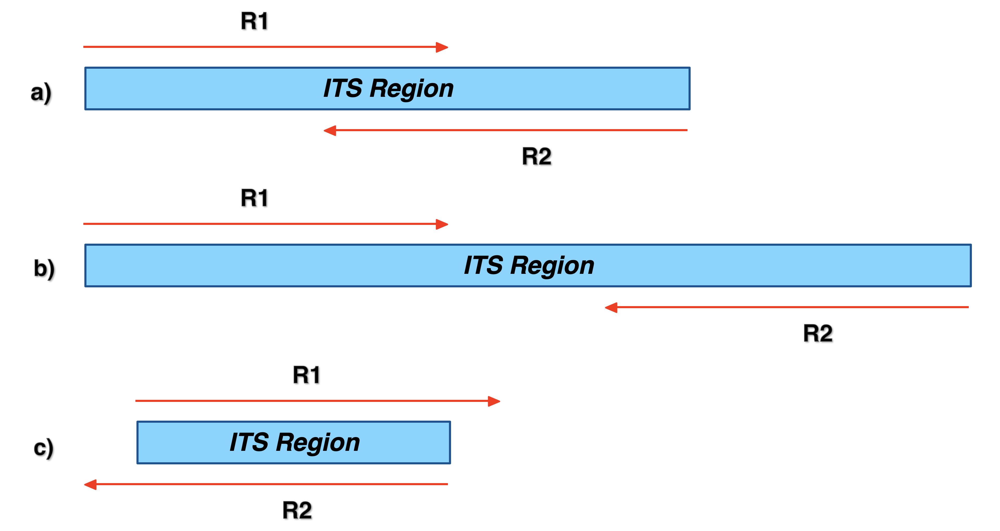

# QIIME2 analysis of ITS data
__This tutorial was simply extrapolated from the main tutorial__

1. [Rationale](#Rationale)
2. [Import ITS data](#step1-import-its-data)
3. [Quality controlling sequences and building Feature Table and Feature Data](#step2-quality-controlling-sequences-and-building-feature-table-and-feature-data)
4. [Summarizing Feature Table and Feature Data](#step-3-summarizing-feature-table-and-feature-data)
5. [Taxonomy assignment](#step-4-taxonomy-assignment)


## Rationale
To focus on the individual steps we decided to follow the 16S case study (ATACAMA) as the main workflow.  
In general, this pipeline can be used for any marker in metabarcoding investigation but in some steps the biological characteristics (and therefore the issues) of certain marker must be considered.

We therefore decided to show the differences between the workflow to be used for the 16S or the ITS.  
**We remind you, however, that each marker has a different evolutionary background given by the selective pressures, so this factor should be considered each time when using scripts.**


Since the differences mainly concern steps from 1 to 5 we have chosen to use data from a [mock community for ITS](http://mockrobiota.caporasolab.us/).  
This is to simplify the interpretation of the results as much as possible.  
By avoiding ecological problems we can focus on the differences given only by the nature of the marker itself.

This mock community is composed by 8 fungal species represented in uneven abundances, that was generated by [Dr. Lee Taylor at UNM, in 2016](https://journals.asm.org/doi/10.1128/aem.02576-16?permanently=true).
It is also available in NCBI SRA as study [SRR4070093](https://www.ncbi.nlm.nih.gov/sra/?term=SRR4070093) and referred as Mock B in the paper.

Before starting to analyse fungal ITS data just a couple of consideration:

*[https://benjjneb.github.io/dada2/ITS_workflow.html](https://benjjneb.github.io/dada2/ITS_workflow.html)*  

We could observe three different situations:  
- The amplified ITS region is longer than the read lengths, the forward and reverse reads overlap to capture the full amplified ITS region, but do not read into the opposite primer;
- The amplified ITS region is longer than the read lengths, the forward and reverse reads do not overlap to capture the full amplified ITS region. **This is the worst condition**; 
- The amplified ITS region is shorter than the read lengths, and the forward and reverse reads extend into the opposite primers which will appear in their reverse complement form towards the ends of those reads.    

Considering both the scenarios pictured above typically occur within the same ITS dataset, a critical addition to ITS worfklows is the removal of primers on the forward and reverse reads, in a way that accounts for the possibility of read-through into the opposite primer.  

---
**PAY ATTENTION**: if the amplified region is longer than about 580 nt we are unable to merge reads.

---

***Considering the whole workflow requires more than 1 hour, we are just going to copy the data in your folder and discussing the steps and the results.***  
```
cd 

cp -r ~/Share/fungi_ITS_tutorial .
```

## Step1: Import ITS data

Create a new folder  
```
conda activate qiime2-2021.8
mkdir fungi_ITS_tutorial && cd fungi_ITS_tutorial
```

*In BASH, the `&&` allows you to perform two action on the same line*  

Download the sequences of the mock community in your new folder:  

```
wget -O "mock-25-sample-metadata.tsv" https://raw.githubusercontent.com/caporaso-lab/mockrobiota/master/data/mock-25/sample-metadata.tsv
wget https://s3-us-west-2.amazonaws.com/mockrobiota/latest/mock-25/mock-forward-read.fastq.gz
wget https://s3-us-west-2.amazonaws.com/mockrobiota/latest/mock-25/mock-reverse-read.fastq.gz
```

Create a  [fastq manifest file](https://docs.qiime2.org/2018.11/tutorials/importing/#fastq-manifest-formats)for importing these data into QIIME 2, fastqmanifest.csv:  
You have to create the **Manifest** file everytime you are not working with EMP or CASAVA data. 
```
echo "sample-id,absolute-filepath,direction" > fastqmanifest.csv
echo "Mock.1,$PWD/mock-forward-read.fastq.gz,forward" >> fastqmanifest.csv
echo "Mock.1,$PWD/mock-reverse-read.fastq.gz,reverse" >> fastqmanifest.csv
```
  
Now we can import the **FASTQ** data in a QIIME2 artifact and demultiplex it:   
```
qiime tools import \
 --type SampleData[PairedEndSequencesWithQuality] \
 --input-path fastqmanifest.csv \
 --output-path demux_fungi.qza \
 --input-format PairedEndFastqManifestPhred33
```
```
qiime demux summarize \
 --i-data demux_fungi.qza \
 --o-visualization demux_fungi.qzv
```

## Step2: Quality controlling sequences and building Feature Table and Feature Data
  
### Quality filter of ITS (optional for Friday groups)
One issue with ITS (and other marker genes with vast length variability) is *read-through*, which occurs when read lengths are longer than the amplicon itself!
Also in this case we want to trim primers from either end of the sequence to eliminate read-through issues.
The polymerase will read through the amplicon, the primer, the barcode, and on into the adapter sequence.  
This is non-biological DNA that will cause major issues downstream, e.g., with sequence classification. So we want to trim primers from either end of the sequence to eliminate read-through issues.  
*Note that we trim the forward primer and the reverse complement of the reverse primer from the forward reads (the forward primers have already been trimmed in the raw reads, but we will demonstrate forward + reverse trimming here since attempting to trim the forward read will not hurt). We trim the reverse primer and reverse complement of the forward primer from the reverse reads.*

|Primer|Sequence|
|:-:|:-:|
|Forward|AACTTTYRRCAAYGGATCWCT|  
|Reverse|AGCCTCCGCTTATTGATATGCTTAART|   

Note that we trim the forward primer and the reverse complement of the reverse primer from the forward reads.  
We trim the reverse primer and the complement of the forward primer from the reverse reads.
The primer trimming is performed by using the tool `cutadapt`[^1] 

```
qiime cutadapt trim-paired \
  --i-demultiplexed-sequences demux_fungi.qza \
  --p-adapter-f AYTTAAGCATATCAATAAGCGGAGGCT \
  --p-front-f AACTTTYRRCAAYGGATCWCT \
  --p-adapter-r AGWGATCCRTTGYYRAAAGTT \
  --p-front-r AGCCTCCGCTTATTGATATGCTTAART \
  --p-cores 2 \
  --o-trimmed-sequences demux-trimmed.qza
```

```
qiime demux summarize \
 --i-data demux-trimmed.qza \
 --o-visualization demux-trimmed.qzv
```

***Why didn't we just cut the primers using length?***

<details>
  <summary markdown="span">Let's try to compare our data pre- and post trimming. Are there any difference?</summary>

    According to Taylor et al. 2016 71, the ITS amplicon length should range among 267-511 bp.  
    So with the read lengths we are using here (250 nt) we should not see any read-through.
    Please note, this is a specific case reagarding fungi, for other Eukaryotes the ITS length ranges could be wider.

</details>

The quality of the reverse reads is too low to use it, so we're going to denoins only the forward read.
```
qiime dada2 denoise-single \
  --i-demultiplexed-seqs demux-trimmed.qza \
  --p-trim-left 13 \
  --p-trunc-len 160 \
  --p-n-threads 2 \
  --o-representative-sequences dada2-single-end-rep-seqs_ITS.qza \
  --o-table dada2-single-end-table_ITS.qza \
  --o-denoising-stats dada2-single-end-stats_ITS.qza
```

## Step 3: Summarizing Feature Table and Feature Data
We have just generated the artifacts containing the feature table and corresponding feature sequences.  
Let's tabulate all the data:  
```
qiime metadata tabulate \
  --m-input-file dada2-single-end-stats_ITS.qza \
  --o-visualization dada2-single-end-stats_ITS.qzv
```

```
qiime feature-table summarize \
  --i-table dada2-single-end-table_ITS.qza \
  --o-visualization dada2-single-end-table_ITS.qzv \
  --m-sample-metadata-file mock-25-sample-metadata.tsv

qiime feature-table tabulate-seqs \
  --i-data dada2-single-end-rep-seqs_ITS.qza \
  --o-visualization dada2-single-end-rep-seqs_ITS.qzv
```

# Step 4 Taxonomy assignment 

## ITS taxonomy assignment 
The QIIME 2 plugin [feature-classifier](https://docs.qiime2.org/2019.1/plugins/available/feature-classifier/) 
supports taxonomic classification of features using a variety of methods, including Naive Bayes, vsearch, and BLAST+.

`q2-feature-classifier` contains several different classification methods: **classify-consensus-blast** and 
**classify-consensus-vsearch** are both **alignment-based methods** that find a consensus assignment across N top hits.  
These methods take reference database `FeatureData[Taxonomy]` and `FeatureData[Sequence]` files directly, and do not need to be pre-trained.

The first step in this process is to assign taxonomy to the sequences in our `FeatureData[Sequence]` QIIME 2 artifact. 

Please download the taxonomic data from **UNITE**:
```
mkdir unite_ref && cd unite_ref
```

```
wget --no-check-certificate https://files.plutof.ut.ee/public/orig/C5/54/C5547B97AAA979E45F79DC4C8C4B12113389343D7588716B5AD330F8BDB300C9.tgz
```

```
tar xvfz C5547B97AAA979E45F79DC4C8C4B12113389343D7588716B5AD330F8BDB300C9.tgz
```
Create artifacts for our reference fasta and taxonomy. Moreover we are also training the classifier:
```
qiime tools import \
  --input-path sh_qiime_release_10.05.2021/sh_refs_qiime_ver8_99_10.05.2021.fasta \
  --output-path sh_refs_qiime_ver8_99_10.05.2021.qza \
  --type 'FeatureData[Sequence]'
  
qiime tools import \
 --type FeatureData[Taxonomy] \
 --input-path sh_qiime_release_10.05.2021/sh_taxonomy_qiime_ver8_99_10.05.2021.txt \
 --input-format HeaderlessTSVTaxonomyFormat \
 --output-path UNITE_taxonomy.qza


cd ..  
```

We will initially perform the taxonomic classificatio by using [**classify-consensus-vsearch**](https://docs.qiime2.org/2019.1/plugins/available/feature-classifier/classify-consensus-vsearch/).


```
qiime feature-classifier classify-consensus-vsearch \
  --i-query dada2-single-end-rep-seqs_ITS.qza \
  --i-reference-reads unite_ref/sh_refs_qiime_ver8_99_10.05.2021.qza \
  --i-reference-taxonomy unite_ref/UNITE_taxonomy.qza \
  --p-threads 2 \
  --o-classification taxonomy_ITS.qza

qiime metadata tabulate \
  --m-input-file taxonomy_ITS.qza \
  --o-visualization taxonomy_ITS.qzv

```

Now create the barplot for vizualize your data

```
qiime taxa barplot \
  --i-table dada2-single-end-table_ITS.qza \
  --i-taxonomy taxonomy_ITS.qza \
  --m-metadata-file mock-25-sample-metadata.tsv \
  --o-visualization taxa-bar-plots_ITS.qzv
```

Now we're also going to use the sklearn classifier.  
Initially, we need to train the classifier. Note in this case you don't need to trim UNITE sequences by using primers. 
```
cd unite_ref

qiime feature-classifier fit-classifier-naive-bayes  \
    --i-reference-reads sh_refs_qiime_ver8_99_10.05.2021.qza \
    --i-reference-taxonomy UNITE_taxonomy.qza \
    --o-classifier sh_refs_qiime_ver8_99_10.05.2021_classifier.qza

cd ..
```
Time to classify and tabulate the results!!!
```
qiime feature-classifier classify-sklearn \
  --i-classifier unite_ref/sh_refs_qiime_ver8_99_10.05.2021_classifier.qza \
  --i-reads dada2-single-end-rep-seqs_ITS.qza \
  --o-classification taxonomy_ITS_sklearn.qza 
  
qiime metadata tabulate \
    --m-input-file taxonomy_ITS_sklearn.qza \
    --o-visualization taxonomy_ITS_sklearn.qzv
  
  
qiime taxa barplot \
  --i-table dada2-single-end-table_ITS.qza \
  --i-taxonomy taxonomy_ITS_sklearn.qza \
  --m-metadata-file mock-25-sample-metadata.tsv \
  --o-visualization taxa-bar-plots_ITS_SKELARN.qzv
```

# Are the obtained classifications comparable? Have a look [here](https://docs.google.com/spreadsheets/d/1e8AI8fgcDECRfXP5uMz1hpZyEoOMRx0Yo0DveuGl4PI/edit?usp=sharing).

[^1]: [https://journal.embnet.org/index.php/embnetjournal/article/view/200/479](https://journal.embnet.org/index.php/embnetjournal/article/view/200/479)

[**Back to the program**](../README.md)