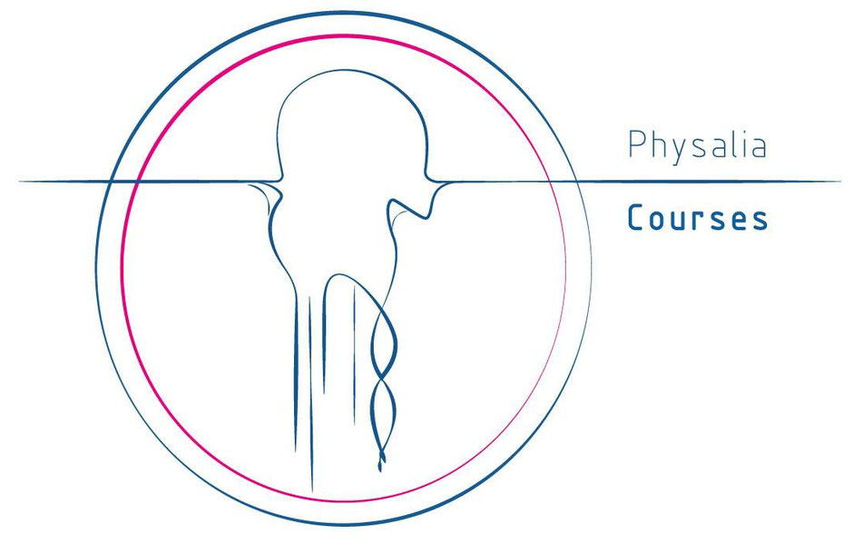

  

# **16S/ITS METABARCODING OF MICROBIAL COMMUNITIES**  

## ***Rationale***
This course will provide a thorough introduction to the application of metabarcoding techniques in microbial ecology.  
The topics covered by the course range from *bioinformatic* processing of next-generation sequencing data to the most important approaches in multivariate statistics. Using a combination of theoretical lectures and hands-on exercises, the participants will learn the most important computational steps of a metabarcoding study from the processing of raw sequencing reads down to the final statistical evaluations. After completing the course, the participants should be able to understand the potential and limitations of metabarcoding techniques as well as to process their own datasets to answer the questions under investigation.  
__FORMAT__  
This course is designed for researchers and students with strong interests in applying novel high-throughput DNA sequencing technologies to answer questions in the area of community ecology and biodiversity.  
The course will mainly focus on the analysis of phylogenetic markers to study bacterial, archaeal and fungal assemblages in the environment, but the theoretical concepts and computational procedures can be equally applied to any taxonomic group or gene of interest.  
__ASSUMED BACKGROUND__  
The participants should have some basic background in biology and understand the central role of DNA for biodiversity studies. No programming or scripting expertise is required and some basic introduction to UNIX-based command line applications will be provided on the first day. However, some basic experience with using command line and/or R is clearly an advantage as not all the basics can be thoroughly covered in that short amount of time.  
All the hands-on exercises will be carried out using [**QIIME2**](https://qiime2.org/) platform . No previous knowledge of computer science is required but a basic knowledge of “bash” would allow to focus more on the microbial analysis.  
__LEARNING OUTCOMES__  
1) Understanding the concept, potential and limitation of microbial metabarcoding techniques.
2) Learning how to process raw sequencing reads to obtain meaningful information.
3) Obtaining experience on how to statistically evaluate and visualize your data.
4) Being able to make informed decisions on best practices for your own data.  
  
  
:exclamation: :exclamation: :exclamation: **All the papers discussed during the course are available in this [Google Drive Folder](https://drive.google.com/open?id=1FLkzwWiBYlIG2FrpceDrgL-ru_A8ZO6_)** :exclamation: :exclamation: :exclamation:    
:exclamation: :exclamation: :exclamation: **Xav has collected all the papers cited during his talks and the links shared in the Slack chat regarding the statistical analysis. You find it [here](https://drive.google.com/drive/folders/1t0eRmPyfRp0rsgh_sE54K2Dkvk2RHxYv?usp=sharing)** :exclamation: :exclamation: :exclamation:  

## Program
[Physalia Welcome](https://drive.google.com/open?id=1zAqld5-NcofYez4QYsGGvX0ZtJGphRNQHCBVwUgYNVE)
## Day 1
- [ ] [Introduction to the course idea and Instructors](Welcome.pptx):  
    - [Xavier Harrison](https://scholar.google.co.uk/citations?user=-LKz8tIAAAAJ&hl=en)  
    - [Daniel Antony Pass](https://scholar.google.com/citations?user=XQml0DQAAAAJ&hl=en)  
    - [Anna Sandionigi](https://scholar.google.com/citations?hl=it&user=DLDuk_EAAAAJ)  
    - [Bruno Fosso](https://scholar.google.com/citations?user=TBeT9pIAAAAJ&hl=it)  
- [ ] [**Brief introduction** about __Metagenomics__ concepts. *What are we going to talk about?*](https://docs.google.com/presentation/d/1JafDY-zalbqZkEA83MLhLHNrCJZ_aqDlfzt22FNKadw/edit?usp=sharing)
- [ ] [**Sequencing technologies** and how the sequences are obtained - Presentation](https://docs.google.com/presentation/d/1BGdfq3lH9avWzLAmXq6RMiOr_F5GEy9i9gyphj6JaYk/edit?usp=sharing)
- [ ] Laptop setting;
  - [ ] [How to connect to the Amazon EC2 service](unix_short_tutorial/how_to_connect.md)  
- [ ] [A brief introduction to **LINUX** and the **BASH** environment - Presentation](https://drive.google.com/file/d/1vGc8ZsNNo6UpK36p9czREym8vwjiLgGo/view?usp=sharing)
- [ ] [Introduction to the **BASH** shell](unix_short_tutorial/Readme.md)
- [ ] [Introduction to the **FASTQ** format and Qiime objects - ppt](https://drive.google.com/file/d/1XvAL2f2PZduU-pXkU83jruMHHTPx5pj2/view?usp=sharing)  

## Day 2
- [ ] [Experimental Design: theory and some points on the  Atacama Soil Experiment](https://docs.google.com/presentation/d/1ybw75VKyMK9vJ_yy2SpFYbn8SZMJ7_6yf-BC0gLJ5vg/edit?usp=sharing)
- [ ] [Atacama Soil Experiment and Loading data](16S_ITS_tutorial/readme.md)
- [ ] [Lets review](unix_short_tutorial/Readme.md)
- [ ] [**Key concept: OTU or ASV**;](https://docs.google.com/presentation/d/1Rxof51tbTxi45_dMlqtbFkQjpWRLTc76uoI6VH8b3hA/edit?usp=sharing)
- [ ] [Denoising and **DADA2**](16S_ITS_tutorial/readme.md#step2-quality-controlling-sequences-and-building-feature-table-and-feature-data);
- [ ] [Taxonomic assignment](https://drive.google.com/open?id=1oHTCBiJ1HoHAREZIN2NVSHnC63QphDUJr_cPbgqgDs4)
- [ ] [Taxonomy assignment: **VSEARCH** vs **classify-sklearn**](16S_ITS_tutorial/readme.md#step3-summarizing-feature-table-and-feature-data);

## Day 3
- [ ] [Diversity Analysis](https://drive.google.com/file/d/1p7UCmfNe0A44Xb8665eaCBps84P7AYRg/view?usp=sharing)
- [ ] [Alpha and Beta Diversity in QIIME2](16S_ITS_tutorial/readme.md#step6-analyzing-alpha-and-beta-diversities)
- [ ] [Some additional Tips](DataImport_and_Tax_management/readme.md)
- [ ] [_It's Case studies Time!!!_]
  - [ ] [Human microbiome data](human_cancer/readme.md)

## Day 4
- [ ] [ITS sequence analysis](ITS/readme.md)
- [ ] [experimental design with R](https://glcdn.githack.com/bfosso/physalia_metabarcoding_oct2021/raw/main/R_tutorial/Introduction_to%20_R.nb.html
- [ ] [Lecture  - Multivariate Analysis of Ecological Communities](https://docs.google.com/presentation/d/1SEXLnsAk71ghWJFBjvnSL9-JIU5kHyYi/edit?usp=sharing&ouid=113644278417838041864&rtpof=true&sd=true)  
  - [ ] Traits of Alpha and Beta Diversity (richness, evenness, dispersion)  
  - [ ] Multivariate Tests for differences in microbial community composition  
- [ ] [Lab  - Multivariate Statistics](https://glcdn.githack.com/bfosso/physalia_metabarcoding_oct2021/raw/main/Day4_5_material/Physalia-Metabarcoding-Course-Oct21.html)  
    - [ ] Data import & preparation (normalisations, transformations, metadata)  
    - [ ] Alpha Diversity (indices of diversity, rarefaction curves)  
    - [ ] Heatmaps to visualise microbial community differences  
    - [ ] Unconstrained and Constrained Ordination (PCoA, NMDS, CCA, DCA)  
    - [ ] Multivariate tests for differences in community composition (PERMANOVA, PERMDISP)  

## Day 5
- [ ] [Lab  - Multivariate Statistics](https://glcdn.githack.com/bfosso/physalia_metabarcoding_oct2021/raw/main/Day4_5_material/Physalia-Metabarcoding-Course-Oct21.html)
  - [ ] Heatmaps to visualise microbial community differences  
  - [ ] Unconstrained and Constrained Ordination (PCoA, NMDS, CCA, DCA)  
  - [ ] Multivariate tests for differences in community composition (PERMANOVA, PERMDISP)
- [ ] [Lecture - Differential Abundance Analysis of Microbial Communities](https://docs.google.com/presentation/d/1Z2F2_goIAuuKXQQ7ocClOgq8x6tbpClW/edit?usp=sharing&ouid=113644278417838041864&rtpof=true&sd=true) 
- [ ] Lab: Differential Abundance Analysis with DESeq2  
- [ ] Analysis of Other Microbiome Datasets  
- [ ] Combining Microbiome data and life history data
