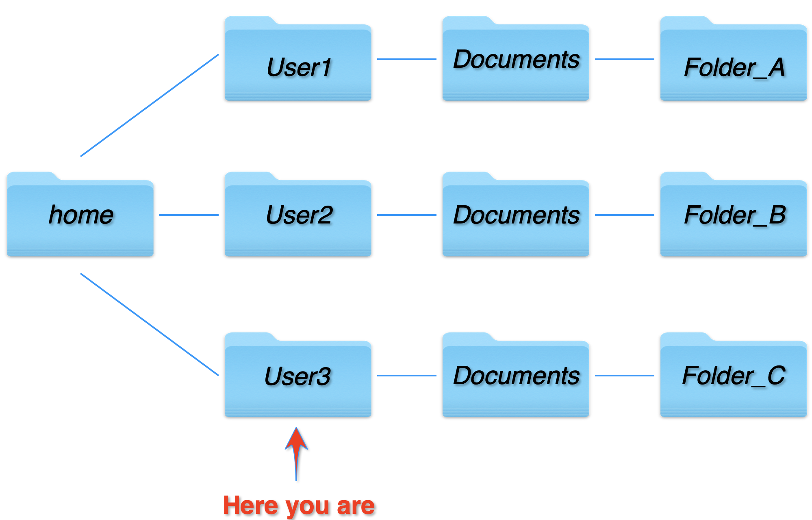
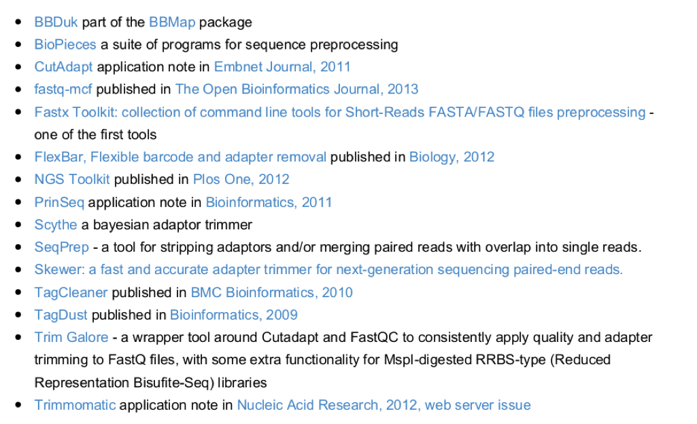

# Introduction to the BASH shell and the FASTQ format

1. [Rationale](#Rationale)  
2. [Some infos about Operative System](#Some infos about Operative System)  
3. [Bash Tips](#Bash tips)
4. [How can we visualize FASTQ quality?](#How can we visualize FASTQ quality?)
5. [FASTQ quality control](#FASTQ quality control)

## Rationale <a name="Rationale"></a>

Most bioinformatics work is done through a **command-line interface**, which rather than the graphical interfaces that we use every day needs exact text commands.
It can be a little **intimidating** at first, but once you understand how it works it will hopefully be clear to you why it is done this way.
The command line allows you to interact with your computer through an entirely text-based interface, allowing you to easily perform repeated operations on different datasets or to perform these analyses on a cluster of computers or on a remote machine for large scale tasks.  
:scream: ***Don't be scared!!! We will start with basic concepts*** :smirk:

Every unix-based system (**it is hard to say but also Mac are UNIX-based systems**) has a **Terminal** and it usually uses a command-line system called ***bash***.    

*[https://it.wikipedia.org/wiki/Unix](https://it.wikipedia.org/wiki/Unix)*

***(If you are Linux or Mac users and do you want to repeat the tutorial you can find the Terminal under Applications/Utilities.)***

## Some infos about Operative System
The Operative System (OS) id the environment in which the programs are executed. Consequently it allows the access to computational and storage resources.
It is possible to define some common characteristics of OSs:
- User interface: today almost all the OS have two interfaces
    - *Command line interface* (**CLI**) <-- ***This is exactly what we are going to talk about***
    - *Graphic User Interface* (**GUI**)
- Programs execution;
- File system management;
- Communication between processes;
- Tracking of errors.

The **CLI** allows you to give commands directly to the OS. Its function is to translate the user choice in the machine language. It is exactly what happens when you use the *Google Translator*.   
We are going to use the **bash** shell, but just to say there are others **terminal shell**, such as **csh** or **ksh**.    
Most of the bash commands used in the Terminal can also be used on Linux or in a Linux emulator, like for example Cygwin, running under Windows.

All bash programs shows a similar usage.  

|    Program    | Options (Flags) | Object |
|---------------|-----------------|--------|
| Program name  | Options modify the program output|the object on which the program is executed|

Below are some exercises intended to help you understand how bash commands work, and what the advantages are.

## Bash tips <a name="Bash tips"></a>
You are now located in your home directory (denoted *~*, **Please keep in mind this symbol**). [Every users has his own **home**.]   
You can always type `pwd` (present working directory) to locate yourself in your file system. The `pwd` command gives you the **path** of your current position in the system.

```
[User3 ~]: pwd
/home/User3
```

The **path** is the description of where something is located in the file system and is a list of directory names separated by slashes.
In Mac, a convenient way to enter long paths in the terminal window is to just drag and drop the file or folder from the finder into a terminal window.
It can also be a good idea to have a **Finder** (or more generally the file manager available in your system) window open next to the Terminal.  

**Shortcuts**: While typing in the Terminal, there are some shortcuts that will make your life easier.
For example, the `UP arrow` &#8679;  will bring back the last command, and the `TAB` &#8677; button will auto-complete a command or filename (as long as it is unambiguous from what you have already typed).

**By typing `ls` (list) you can see all the contents of the folder you are in.**
```
[User3 ~]: ls
Share
```

All bash commands have a manual page. By typing `man [command]` you can view it. Within the manual, the space bar will move you down a page and `q will quit.

**Now, open the manual page for the ls command.**
```
[User3 ~]: man ls
```  
**Exit the manual page my typing `q`.**   
By adding “*flags*” after a command (usually with space, then a dash `-` and a letter code), we can alter the execution of the command.  
For example, the flag `–l`, when added to the ls command, prints the contents of a folder in long format. Try this:
```
[User3 ~]: ls -l
total 0
drwxr-xr-x    3 User3  User3     96 Mar 30 11:27 Share/
```
The `ls -l` command prints out permissions for each file in a folder, like this:
drwxr-xr-x, where the *d*, if present, means that the item is a directory and r=read, w=write, x=execute (for programs).  
The permissions are listed in the following order: *User*, *Group* and *All*.  
It means the User (who created the folder) can read, write and execute, while Group and All may only read and execute.  
In Unix system to make accessible files and programs to different users, the **System Administrator** may create **Groups**. In this way it is possible to facilitate data usage and optimize the storage.


To create new folders and to copy or move files we usually use Finder on a Mac, but this can be done also with the Terminal.
To create a new folder the command is `mkdir` (make directory).  
```
[User3 ~]: mkdir test
[User3 ~]: ls
Share/ test/
```
The `cd` (change directory) program is used to move among directories
```
[User3 ~]: cd test
[User3 ~]: pwd
/home/User3/test
```

If you get lost, you can always return to your home directory with `cd`.
```
[User3 ~]: cd
[User3 ~]: pwd
/home/User3/
```
Just to make it complete clear `cd` without any object move you to the *user home folder*.  

There are other *shortcuts* you need to keep in mind:  
    - `..` means previous folder;  
    - `.`  current previous folder;
So for example if you would like to list the content of the /home/ folder in our example you may just type:
```
[User3 ~]: ls ..
User1/ User2/ User3/
```   

You can also use "glob patterns" to select specific files:
 - an asterisk (*) means any string of characters
 - a question mark (?) means a single character
 - square brackets ([]) can mean a range of characters

Use this to list all the files that begin "sub"


We are now going to copy spome test files into our area and investigate. The file is in the ~/Share/Linux-exercises folder. 

Copying and moving uses a standard format whether it’s within one server or between separate ones:
```
command      source      destination
```
For example, to move a file named RNAseq_1.fastq into a new folder that exists in this directory named exp1:
```
EXAMPLE mv RNAseq_1.fastq exp1
```
To move it to a location somewhere else on the server you can use the full path
```
EXAMPLE mv RNAseq_1.fastq /mnt/clusters/test/experiment1
```
Or alternatively “move” a file from one name to another. This is a common way to rename your files:
```
EXAMPLE mv RNAseq_1.fastq LRubellus_1.fastq
```
To copy, use the cp command. You could copy a file from another directory to “here” like so, remembering that a full-stop means “the folder I’m currently in”:
```
EXAMPLE cp ~/classdata/RNAseq_1.fastq  .
```
Often you’ll want to copy a whole folder (directory), and you will need the -r parameter for “recursive”.
```
EXAMPLE cp -r /home/data/all_fastqs NewExperiment/testdata/
```

Copy the files to the **test** folder with the command `cp [file to be copied] [destination folder]`.  
TIP: you can use `*` as a wildcard to choose all files with a certain suffix, i.e. “*.fastq” or “*.fq”
If you are in your homespace you can do this, however if you are already inside the test folder then you can use "." to mean "this folder"
```
cp -R ~/Share/Linux-exercises test/
```

**Now, move back to your “test” folder.**

By typing ls (list) you can see all the contents of the folder you are in.

All bash commands have a manual page. By typing man [command] you can view it. Within the manual, the space bar will move you down a page and q will quit.

Now, open the manual page for the ls command.


---------------------------------------------------------------------------------------------------------------------
### FASTQ format
[FASTQ](https://en.wikipedia.org/wiki/FASTQ_format) files are text files containing sequence data with a quality (Phred) score for each base, represented as an ASCII character.   
The quality score is an integer (Q) which is typically in the range 2 - 40, but higher and lower values are sometimes used. In particular, versions 1.8 and later of the Illumina platform generate reads with Q scores up to 41.  
  
*FASTQ read with 50nt in Illumina format (ASCII_BASE=33).*  
There are always four lines per read:
1. The first line starts with '@', followed by the label (read identifier);  
2. The second line contains the observed sequence;
3. The third line starts with '+'. In some variants, the '+' line contains a second copy of the label;
4. The fourth line contains the Q scores represented as ASCII characters.
---------------------------------------------------------------------------------------------------------------------

To view what the fastq files look like, the edit command would open a file in a Text Editor, such as **gedit** (**NOT WORD OFFICE or any similar software!!!**).  
With the abbreviated test files, it might work, but normal fastq files are too large.  
We can, however, open a part of the file using the editor `less`.   

**Use `less` to view a fastq file**. You can move down through the file with space, and quit back to the Terminal with `q`.
```
less Illumina_1.fastq
```

You can also view the top or bottom 10 lines of a file with the commands `head` and `tail`.
**Use tail to view the bottom 10 lines of a fastq file.**
```
tail Illumina_1.fastq
```
**Now, use the manual page for `tail` to find out how to view more than 10 lines and use `tail` again to view the bottom 50 lines of a fastq file.**
```
man tail

tail -n 50 Illumina_1.fastq
```
This prints out the lines to the screen.  
However, we can redirect the output to a file with the `>` symbol. Like this: `[print command] > file.txt`.  
The double angle bracket, `>>`, does the same thing but appends information to a file rather than overwriting it.

**Use the > to print the last 50 lines of a fastq file to a new file, called tail50.txt
Open the new file in less with less tail50.txt**
```
tail -n 50 Illumina_1.fastq > tail50.txt
less tail50.txt
```
Quit `less`.  

One of the most useful commands in the Terminal is `grep`. This command searches through a text for lines matching a given argument and prints out only the lines that contain the argument.  
Try using grep to pull out any read that contains the sequence **CTCCTAC** from a fastq file:
```
grep CTCCTAC Illumina_1.fastq
```
Used in combination with other commands, grep can do almost anything. To combine commands, we can use the “pipe”, `|`. It takes the output from one command and feeds it into another command.

The command `cat` prints a whole text file or combines several files into one and prints to the screen. Using the `–b` flag, you can also count lines.
```
cat -b tail50.txt
```
The command `cat` prints a whole text file or combines several files into one and prints to the screen. Using the `–b` flag, you can also count lines.
```
tail -n 50 Illumina_1.fastq | grep '^@'
```
This will print only the lines starting with `@` symbol, i.e. the identifier lines, out of the last 50 lines of a file. The `ˆ` means "*start with*".  
Use `grep -c`  to find out how many reads there are in one of the fastq files.
```
grep -c '^@' Illumina_1.fastq
```
**Use grep to pull out all the identifier lines from samples `Illumina_1.fastq` and redirect them into a new file called `identifiers_sample1.txt`**
```
grep '^@' Illumina_1.fastq > identifiers_sample1.txt
```
`grep` allows you to search in text file by using the **Regular Expressions*.  
**What are regular expressions?**  
Regular expressions are special sequences of characters that define a possibly complex search pattern.
For example:
 - `^` matches the beginning of the line;
 - `.` matches any character
 - {m,n}   matches the preceding elements at least m but not more than n times.

The Regexp pattern language is unlike most other computing languages. It can be best learned via an interactive service like [](https://regexone.com/) or many others where the pattern and its effect are instantly visualized.  
*how to convert a fastq file into a fasta in bash*:
```
grep -A1 '^@SRR' Illumina_1.fastq > example.fa
sed -i -e 's/^@/>/g' example.fa
sed -i -e 's/^--//g' example.fa
sed -i -e '/^$/d' example.fa
```

# Using text editors

Plain text files are important, both as input to bioinformatics programs and as input or configuration files for system programs. We highly recommend that you learn to use a text editor to prepare and edit plain text files.

#Text files, Word Processors and Bioinformatics
Documents written using a word processor such as Microsoft Word or OpenOffice Write are not plain text documents. If your filename has an extension such as .doc or .odt, it is unlikely to be a plain text document. (Try opening a Word document in notepad or another text editor on Windows if you want proof of this). Word processors are very useful for preparing documents, but you shouldn’t use them for working with bioinformatics-related files.

We recommend that you prepare text files for bioinformatics analyses using Linux-based text editors and not Windows- or Mac-based text editors. This is because Windows- or Mac-based text editors may insert hidden characters that are not handled properly by Linux-based programs.

Some professional programs can be installed locally (i.e. notepad++) but when working on a terminal there are many options which range in ease of use, and each has its pros and cons. In this practical we will briefly look at two editors, nano and vi.


### Nano

Pros: 
- Very easy – For example, command options are visible at the bottom of the window
- can be used when logged in without graphical support
- Fast to start up and use

Cons:
- It is not completely intuitive for people who are used to graphical word processors
- Has few features

### Vi/vim

Pros
- Appears on nearly every Unix system. 
- Can be very powerful if you take the time to know the key short-cuts
- Has built in find/replace

Cons
- You have to know the shortcuts!
- There are no menus and no on screen prompts

EXERCISES
Create a file with nano
```
nano test_nano.txt
# Type some text, exit with ctrl X, save and return to command line
# Now show the contents of the file you created:
less test_nano.txt
```

Create a file with vi
```
vi test_vi.txt
# Type ‘i’ and you can then add text (I for input)
# Save and exit, first pressing [esc] to exit write mode :wq – (wq for write and quit)
# Now show the contents of the file you created
less test_vi.txt
```

## How can we visualize FASTQ quality?  <a name="How can we visualize FASTQ quality?"></a>
The undisputed champion of quality control visualization is a tool named **[FastQC](https://www.bioinformatics.babraham.ac.uk/projects/fastqc/)** developed by **Babraham Institute**, an independent, charitable life sciences institute involved in biomedical research.  
Even though it is a de-facto standard of visualization, **its results are not always the simplest to interpret**.  
On  the positive side, the tool is easy to run (requires only Java), simple, reasonably efficient (though it is tuned for the Illumina platform and may be unstable on other types of data) and produces aesthetically pleasing plots.   
On the downside, some of its beautiful charts are uninformative and occasionally confusing. For example, in some cases, charts will switch from non-binned to binned columns within the same panel, easily misleading casual observers.  
Then there are plots, such as the **K-MER** plot and the **Overrepresented Sequences** plot, that don't show what most people assume they do.   
There is also the difficulty of having to open HTML files one by one for result interpretation. In the current state of the field, where dozens of samples are being investigated in any given sequencing run, even just opening the results of the QC analysis becomes exceedingly tedious.  
The seemingly simple task to check the data quality requires clicking and scrolling through each file individually. To some extent, even the tool's name is confusing.   
**FASTQC does not perform quality control: it only  visualizes the quality of the data.**  
But even with its flaws, FASTQC is still by far the best FASTQ quality visualization tool. It is one of the tools that scientific funding agencies should seek to fund even if the author were not to apply for funding.

Type:
````
fastqc Illumina_1.fastq
````
We now can download the outputted .html file and explore it on our own computers.

*Illumina vs PacBio*  

## FASTQ quality control <a name="FASTQ quality control"></a>
List of tools for FASTQ Quality Control



[**Back to the program**](../README.md)
