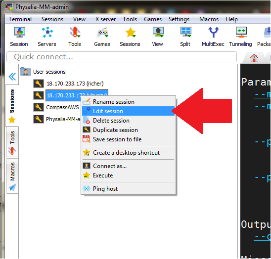
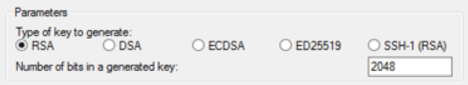
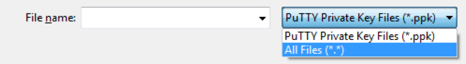
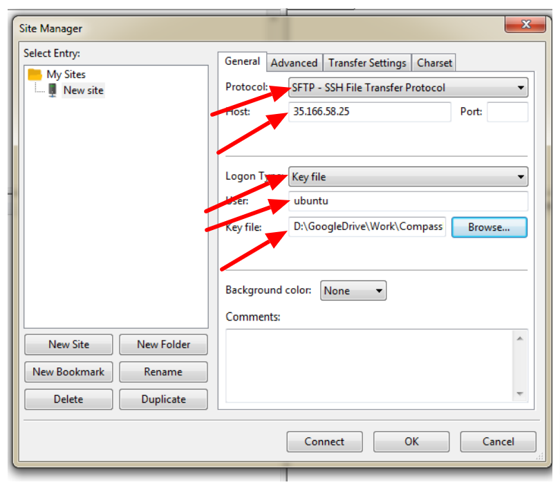
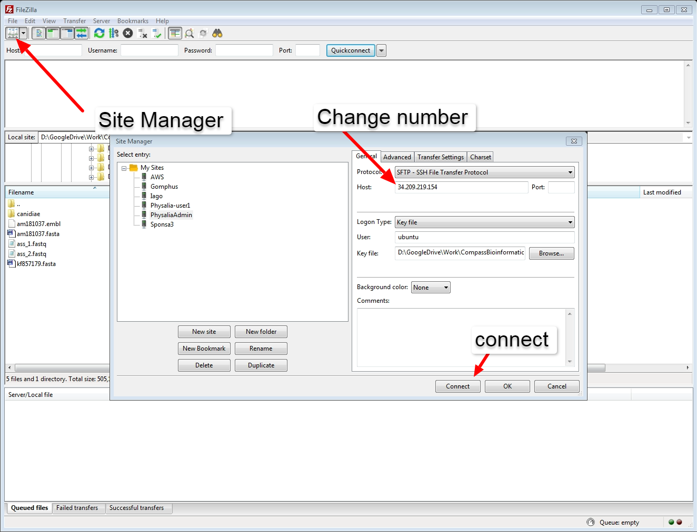

# Connection to the Amazon EC2 service

## How to connect 
Most of the course actvities will be performed on a Amazon EC2 machine so we need to connect to it.
You received an e-mail with your **user** number and the associated **ssh-key.pem**. You will need this number for all the commands below. 
The examples will be for the user *user28* - you will need to replace 28 with your own, unique number. 
Note also that the login name (internet address) for Amazon will change daily. We will help with this.

### Windows users using MobaXterm

1. Download Client: The free client can be downloaded from http://mobaxterm.mobatek.net
2. Start a new SSH terminal  (1&2). 
    
3. Add the host address (3), username (4), and pem file (5) and press "ok".
    
4. Moba saves your sessions down the left side of the screen, or can be swapped to a file browser for downloading

### NOTE: You do not need to repeat this when the server IP address changes. You just right-click and select "edit session" and change the IP address

### Windows users using Putty
1. Create a windows key:  
    We need to convert the key file to a format that is compatible with Windows. We do this using **PuTTYGen**.  
    - Start PuTTYgen (for example, from the Start menu, choose **All Programs > PuTTY > PuTTYgen**).
    
    - Under Type of key to generate, choose RSA.  
    - Choose **Load**. By default, PuTTYgen displays only files with the extension .ppk. To locate your .pem file, select the option to display files of **all types**.
    
    - Select your .pem file that we sent you, and then choose **Open**. Choose **OK** to dismiss the confirmation dialog box.
    - Choose **Save private key** to save the key in the format that PuTTY can use. PuTTYgen displays a warning about saving the key without a passphrase. Choose **Yes**.
    - Specify the same name for the key that we have given you (e.g. **user28**. PuTTY automatically adds the .ppk file extension.
    - Your private key is now in the correct format for use with PuTTY. You can now connect to your instance using PuTTY’s SSH client.
2. Starting a PuTTY session:
    - Start PuTTY (from the Start menu, choose **All Programs > PuTTY > PuTTY**)
    - In the Category pane, select *Session*  
    - In the Host Name box, enter your username(e.g. user28), followed by `@`, followed by the public **DNS** name. This changes each day and we will email it to you. In total you will have something like **physalia28@ec2-54-187-83-150.us-west-2.compute.amazonaws.com**  
    - Under *Connection type*, select *SSH*.
    - Ensure that the *port* is *22*  
      
    - In the Category pane, expand *Connection*, expand *SSH*, and then select *Auth*.
    - Choose *Browse*.
    - Select the .ppk file that you generated using PuTTYGen, and then choose *Open*.
    - Choose *Open* to start the PuTTY session.
    - ***If this is the first time you have connected to this instance, PuTTY displays a security alert dialog box that asks whether you trust the host you are connecting to. Choose yes***.

### Mac and Linux Users
1. Open a terminal (on Mac, cmd + space, then type “terminal” and press )  
2. Change your working directory to the folder containg your .pem physalia, using cd. Something like:  
    `cd ~/Documents/PopGenBerlin`  
3. Change the key permission:  
    `chmod 600 c28.pem`  
4.Now use your username and the public DNS (this will be emailed to you each day) to log onto the server via SSH. The command will be something like the following (for user user28):  
    `ssh -i c28.pem user28@18.237.136.18`

## FileZilla configuration
In order to use **FileZilla** to download data from the EC2 Amazon instances to your computer and vice versa, just use the following indication:  
1. Download the ***FileZilla Client*** directly from [here](https://filezilla-project.org);  
2. Install and open it;  
3. Select *Site Manager* and create a new istance:
    * Protocol: **SFTP**  
    * Host: **18.237.136.18**  
    * Logon: **Key File**  
    * User: **the user name used to access the EC2 Amazon instance**  
    * Key file: **the same .pem file you used for the connection**   - NOTE! You have to selct that it is a pem format file when in file browser
  

## To change the IP address for a new day all you need to do is edit the Host field with the new number
  

[**Back to the program**](../README.md)
